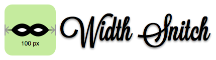

**Width Snitch** creates a child container just to show the `<body>` width and its content width (if they are different). That's all :)

I know, I know, it is pretty simple, but this is what I need to work with media queries.


## Usage

Create a new instance of `widthSnitch` object.
I like using a development class ('dev') just in case I forget to remove both the plugin and the js code before uploading/delivering… You know, sometimes it happens…

```html
<script src="js/width-snitch.min.js" defer></script>
<script defer>
	window.addEventListener('load', () => {
		const isDev = document.querySelector('body').classList.contains('dev');

		if (isDev) {
			const wsSettings = {
				style: {
					backgroundColor: 'rgba(0,0,0,.8)',
					border: 'none',
					borderRadius: '5px',
					boxShadow: '0 1px 5px rgba(0, 0, 0, .3)',
					color: '#fff',
					font: '1em arial, sans-serif',
					padding: '.5em 1em',
					position: 'fixed',
					right: '.5em',
					top: '.5em',
					zIndex: '666',
				}
			};
			const ws = new widthSnitch(wsSettings);
		}
	});
</script>
```

### Options

| Option | Type | Description   |
| ------ | ---- | ------------- |
| *className* | String | (Optional) The class name of the width container, `snitch` will be used as default class name. |
| *style* | Object | (Optional) Styles can be defined through the `style` option or inside the main css file. It's up to you. |

## Demo

* [See it in action](https://oneeyedman.github.io/Width-Snitch/)


## License
[The Unlicense](LICENSE.txt)
